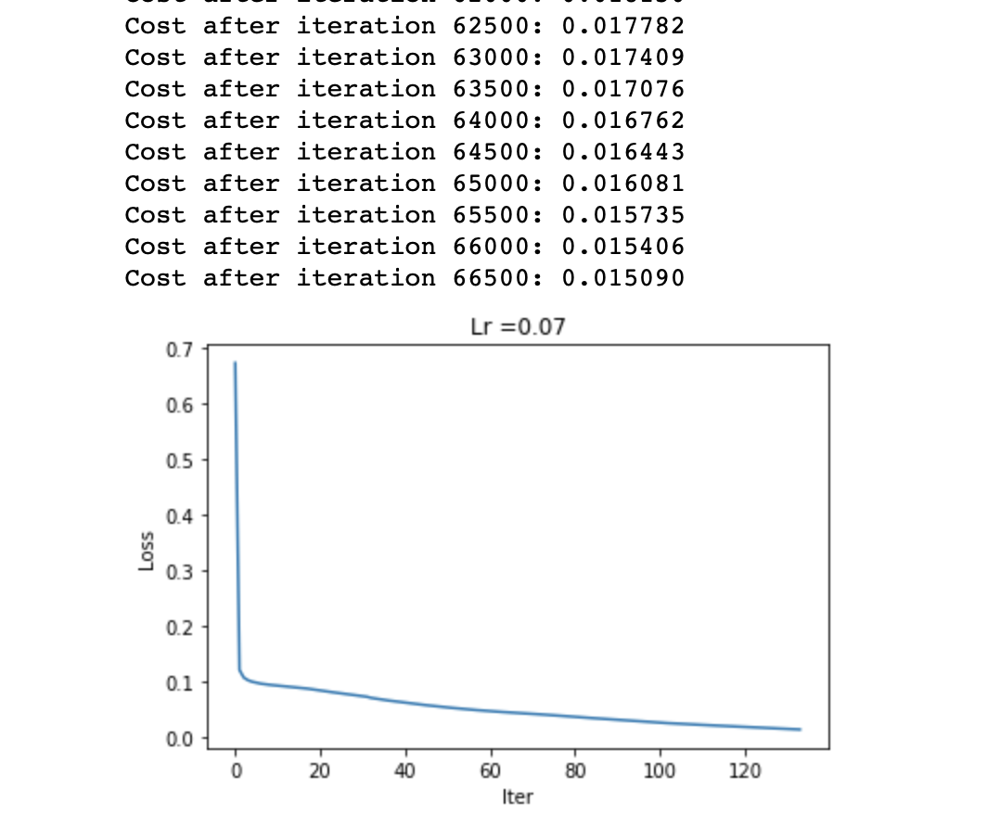

# Machine Learning Project 3
One Neuron to Another

# Authors
- Sandip Dey
- Shambo Ghosh

# Introduction
- There are two Jupyter Notebook :
  - Neural_Network_Cancer_Dataset.ipynb - To predict if a person has benign or malignant tumour from 9 features in the dataset
  - Neural_Network_Liver_Dataset.ipnyb - To predict if a person has a liver disease or not from 10 features in the dataset
  
# Dataset Used
- Wisconsin Cancer Dataset - https://archive.ics.uci.edu/ml/datasets/Breast+Cancer+Wisconsin+(Diagnostic)
- Liver Disease Dataset - https://archive.ics.uci.edu/ml/datasets/liver+disorders

# How to run the program
Just run the Jupyter Notebook through Anaconda

# Process Explanation
We are implementing a two layer NN where input layer has neurons equal to the features in our respective dataset and the hidden layer has 15 neurons for cancer dataset and 20 neurons for liver dataset

*Example of one such Neural Network*

The implementation process is explained in detail in each notebook.

# Accuracy

The weights and bias of each network was decided after 67000 epochs and 75000 epochs for respective dataset which gave an accuracy as shown in the below images

*Loss Function after 67000 for Cancer Dataset*

*Accuracy through confusion matrix for Cancer Dataset*

# Project Structure
- Data : Datasets
- Notebook : Neural_Network_Cancer_Dataset.ipynb and Neural_Network_Liver_Dataset.ipnyb
- Vizualisation - Accuracy graph

# References
https://medium.com/coinmonks/neural-network-from-scratch-tumour-diagnosis-354abbcb2f3b

